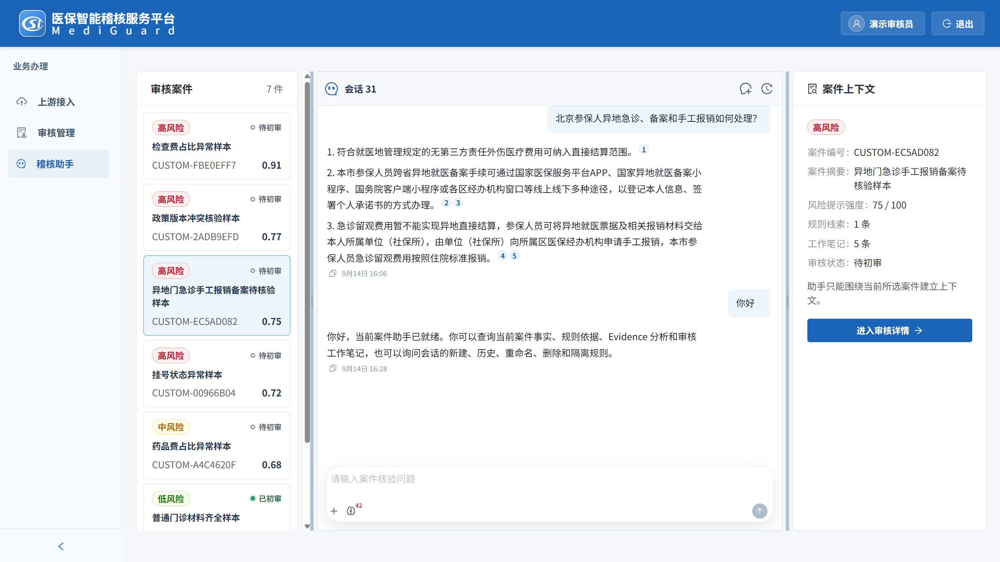
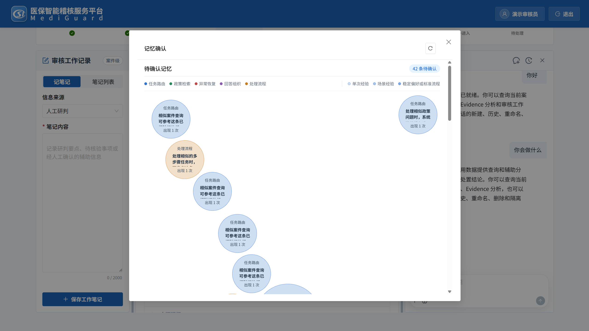
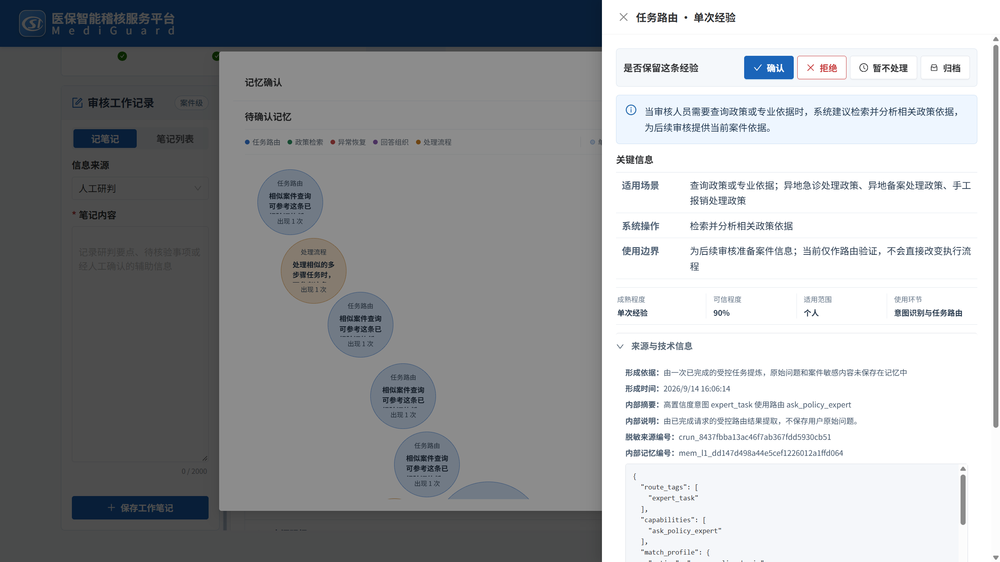
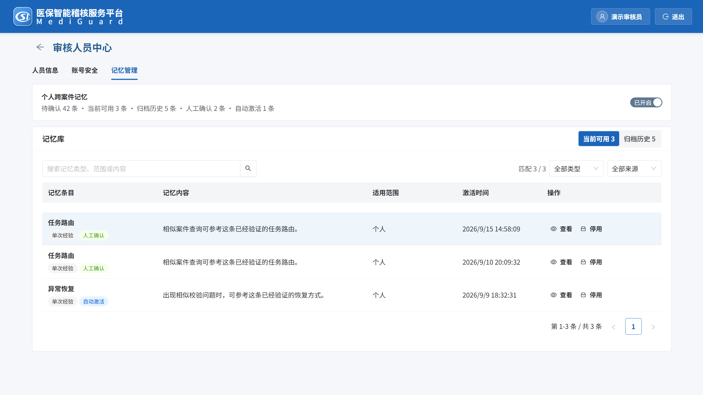
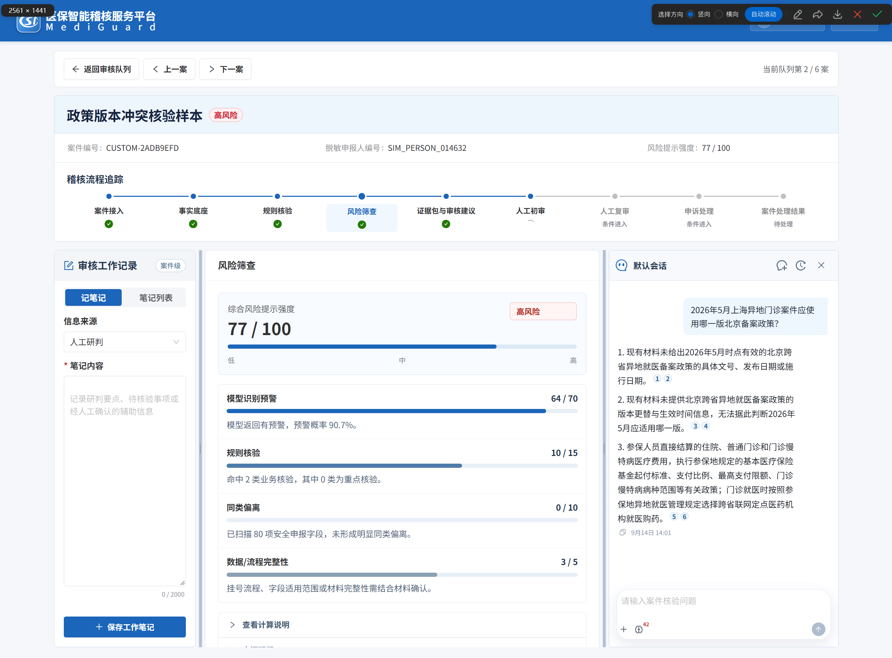

# Mediguard：医保智能稽核服务平台

> 面向医保智能稽核场景，融合风险模型、规则引擎与 Multi-Agent。系统以确定性九阶段流程承载业务状态，将 Caser 作为嵌入式案件助手，通过规划、执行、总结和校验工作流编排专家 Agent，完成风险筛查、证据复核、政策溯源和人工审核辅助。

[在线演示](https://mediguard.muxingli.com/)



## 项目介绍

Mediguard 面向医保审核员的单案稽核工作。系统将脱敏案件接入、模型风险信号、确定性规则、证据复核、政策知识库和人工初审放在同一工作台内，并使用九阶段 Workflow 记录案件状态。

Caser 是嵌入审核流程的案件助手。它根据任务确定性和复杂度选择查询、派生分析或专家 Agent，在调用预算和权限边界内组织证据、回答案件问题。系统风险分、规则结果和最终审核意见仍由确定性模块或审核员负责。

## 技术亮点

### 能力分层
按照任务确定性与复杂度划分能力层级。L1 以 Text-to-Metrics 覆盖高频问数，并使用受控 Text-to-SQL 处理长尾查询；L2 对已读取事实执行聚合、筛选、排序、同类对比和规则指标解释；L3 调度 Review Advisor、Policy Expert 等领域专家 Agent。Caser 按依赖关系编排执行 DAG，减少简单任务进入复杂推理链路带来的成本和不稳定性。

### 记忆治理
同类异常案件在地区政策、业务场景和风险模式上存在共性。针对跨案件经验分散、重复核验和审核口径偏差，系统构建四层记忆体系，支持经验自动沉淀、分级准入和人工确认。召回链路融合混合检索与 Graph 关系扩展，通过 `scope`、`status`、`level` 门禁和消费视图控制披露范围，实现同类经验的关联召回、受控复用、审计和撤销。

### 知识库检索
医保政策存在地区、版本、领域和有效期差异。检索链路先按地区、政策域、业务场景和有效期过滤，再融合 BGE-M3、BM25 与 RRF，并结合多领域分组检索、动态召回预算和条件 Reranker 处理跨领域问题及长文档。在 297 条评测数据上，Hit@5 达到 99.0% 以上，Context Recall@5 从 79.9% 提升至 92.4%。

### 可信生成
面向审核场景对证据充分性、结论可核验和引用可追溯的要求，系统以信息点为回答单元，通过问题拆解、证据覆盖判断、按需查询、重写和补检索完善证据链。生成阶段执行句级证据抽取、可回答性判断、主张与引用绑定以及引用闭环校验。Answer Correctness `AC[0.75, 0.25]` 达到 85.2%，Faithfulness 达到 98% 以上。

## 核心业务流程

```text
脱敏记录接入
  -> 字段与安全校验
  -> 案件生成
  -> 模型风险信号
  -> 确定性规则核验
  -> 证据包与 Review Advisor
  -> Caser 辅助分析
  -> 人工初审
```

确定性九阶段流程负责业务状态和人工节点：

```text
案件接入 -> 事实底座 -> 风险筛查 -> 规则核验 -> 证据包与审核建议
-> 人工初审 -> 人工复审（条件阶段） -> 申诉处理（条件阶段） -> 案件处理结果
```

## Caser：案件智能研判中枢

Caser 围绕当前案件上下文工作，将用户问题转化为结构化任务，再按照依赖关系组织能力调用：

```text
感知 -> 规划 -> 执行 -> 总结 -> 校验
```

| 层级 | 作用 | 示例 |
| --- | --- | --- |
| L1 | 读取与确定性查询 | 案件事实、风险信号、规则结果、Text-to-Metrics、受控 Text-to-SQL |
| L2 | 派生分析 | 聚合、筛选、排序、TopN、同类对比、规则指标解释 |
| L3 | 调度专家能力 | Review Advisor、Policy Expert、复杂政策与跨域分析 |

Caser 将工具结果、专家结果和来源引用组合为结构化回答，并在输出前执行权限、结构、引用和结果一致性校验。证据不足时，系统返回缺失项和待核验事项，不使用模型常识补齐案件事实或政策结论。

## Case Memory：跨案经验治理与复用

Case Memory 不直接保存完整历史对话，而是从已完成任务中提取可复用经验，将其作为有来源、有状态、有适用范围的结构化对象管理。

```text
经验提取 -> 分层准入 -> 人工确认 -> 记忆激活 -> 受控召回 -> 审计与撤销
```
### 跨案经验候选准入



系统将任务路由、政策检索、异常恢复、回答组织和处理流程等候选经验分类呈现，由审核人员决定确认、拒绝或暂缓。未经确认的候选不会直接进入可消费记忆视图。

### 经验审定与适用边界



每条记忆记录适用场景、系统操作、使用边界、成熟度、置信度、适用范围和形成依据。审核人员可以确认、拒绝、暂不处理或归档，并通过状态历史追踪治理过程。

### 审核经验资产库



已确认记忆进入个人记忆库，支持检索、分类、查看、停用和归档。Caser 只读取通过 `scope`、`status`、`level` 过滤后的消费视图，不直接访问完整历史案件、原始问题或模型内部推理。

## 单案智能稽核工作台



单案智能稽核工作台将九阶段流程、审核工作记录、系统风险筛查和 Caser 放在同一办理界面。系统综合风险提示由后端确定性计算，Caser 只围绕当前案件提供事实查询、证据分析和政策辅助，不修改风险分、规则结果或人工审核结论。

## 技术栈

- **前端：** React、TypeScript、Vite、Ant Design、Ant Design X
- **后端：** Python、FastAPI、Clean Architecture
- **Agent：** LangGraph StateGraph、能力 DAG、结构化工具调用、事件与引用校验
- **案件记忆：** PostgreSQL、SQL Graph/BM25、Mem0/Graph 投影、消费视图
- **政策知识库：** BGE-M3、FAISS/Qdrant、BM25、RRF、条件 Reranker、Ragas
- **风险分析：** 确定性规则引擎、本地 XGBoost 模型推理适配器、PCA 综合指标
- **持久化：** PostgreSQL、SQLAlchemy、Alembic
- **质量保障：** Pytest、检索与生成评测、Agent 结构校验和引用闭环校验

## 核心代码导航

| 模块 | 代码位置 | 说明 |
| --- | --- | --- |
| 案件智能研判中枢 | `src/frontend/src/components/AssistantWorkspacePage.tsx` | 案件列表、对话区和案件上下文 |
| 单案智能稽核协同面板 | `src/frontend/src/components/CaseAgentPanel.tsx` | 单案办理中的助手入口与交互 |
| Caser 后端编排 | `src/backend/application/showcase/case_agent.py` | 案件任务、工具调用和运行控制 |
| Caser 领域对象 | `src/backend/domain/case_agent/` | Agent 运行、任务状态和结构化实体 |
| 跨案经验准入治理 | `src/frontend/src/components/MemoryGovernancePanel.tsx` | 记忆候选池与人工确认 |
| 经验资产审定详情 | `src/frontend/src/components/MemoryBusinessDetail.tsx` | 记忆内容、来源、边界和结构化动作 |
| 记忆状态历史 | `src/frontend/src/components/MemoryStatusHistory.tsx` | 记忆状态变化与审计记录 |
| 记忆领域对象 | `src/backend/domain/case_memory/` | 记忆层级、状态和业务实体 |
| 记忆接口 | `src/backend/application/ports/case_memory.py` | 记忆服务的应用层契约 |
| 记忆持久化 | `src/backend/infrastructure/persistence/sql/repositories/memory_repo.py` | PostgreSQL 记忆仓储 |
| Review Advisor | `src/backend/application/showcase/review_advisor.py` | 证据复核和审核建议 |
| 风险引擎 | `src/backend/domain/audit/review/risk_engine.py` | 系统综合风险提示计算 |
| 规则引擎 | `src/backend/domain/audit/review/rule_evaluator.py` | 确定性规则命中 |
| 证据包 | `src/backend/domain/audit/review/evidence_packager.py` | 证据整理和引用来源 |
| Policy RAG | `src/backend/application/policy_rag/` | 政策信息需求、检索和证据返回 |
| API 路由 | `src/backend/api/routes/` | 认证、审核、记忆和 Caser 接口 |
| 自动化测试 | `src/backend/tests/` | API、Agent、记忆、规则和检索测试 |

## 知识库评测

政策知识库使用 297 条独立评测数据验证检索与生成质量。以下指标用于研发对比，不代表生产医保审核准确率：

| 环节 | 指标 | 结果 |
| --- | --- | ---: |
| 检索 | Hit@5 | ≥ 99.0% |
| 检索 | Context Recall@5 | 79.9% -> 92.4% |
| 生成 | Answer Correctness `AC[0.75, 0.25]` | 85.2% |
| 生成 | Faithfulness | ≥ 98% |

## 数据与安全边界

- 公开代码不包含真实患者身份、原始票据、完整医疗记录或生产数据库
- `RES` 只用于离线评估和离线样本选择，不进入 Agent 上下文、API、Trace 或前端
- `个人编码` 只使用 `SIM_PERSON_000001` 形式的合成脱敏编码
- LLM 不计算风险信号，不修改模型信号、规则结果、源数据或人工审核结论
- Agent 不自动拒赔、不自动处罚、不自动认定欺诈
- 本地模型、向量索引、原始政策语料和密钥不作为公开仓库资产

## 当前限制

- 项目是脱敏业务场景和 Agent 工程能力演示，不连接生产医保系统
- 人工复审和申诉处理是条件阶段，不替代真实生产流转
- Policy RAG 的原始语料和索引资产需要根据授权在本地准备
- 在线演示是轻量访客沙盒。当前使用 PostgreSQL SQL Graph/BM25 作为记忆真相和召回后备，Mem0、pgvector、BGE Reranker 等可选能力可能关闭

## 项目来源

教育部、商务部联合主办竞赛，赛题源自华为、百度等企业需求。项目获得全国三等奖（8801 支团队，约 Top 5%）。

## 代码使用说明

本仓库公开用于个人项目展示、面试评审和技术交流，未附开源许可证，不代表授权复制、修改、分发或商业使用。
